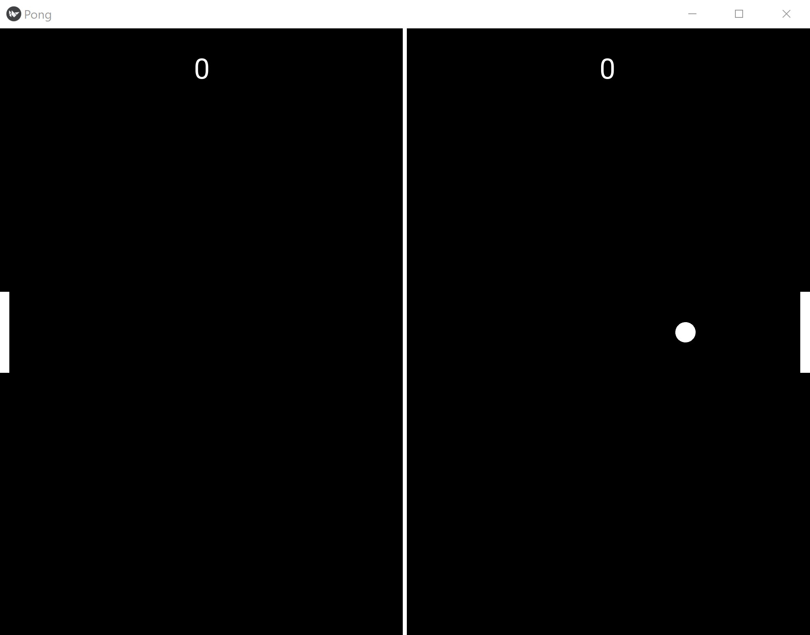

# Old-Simple-Pong
## Table of Contents
- [About the Project](#about-the-project)
  * [Introduction](#introduction)
  
- [Getting Started](#getting-started)
  * [Prerequisites](#prerequisites)
  * [Installation](#installation)
- [Usage](#usage)
- [Remarks](#remarks)
- [Future Updates?](#updates)

## About the Project
### Introduction
This project includes the implementation presented in the **Pong Game Tutorial** found at [https://kivy.org/doc/stable/tutorials/pong.html#](https://kivy.org/doc/stable/tutorials/pong.html#), albeit with some further modifications and functional additions.

## Getting Started
### Prerequisites
To compile and run this script, Python 3 must be installed; the following [link](https://www.python.org/) can be used to download shuch a requirement. For the time being, the version of Python 3 which was used was **Python 3.10.5**.

In addition, it should be noted that the Micrsoft's Visual Studio Code software was used as well. It can be found [here](https://code.visualstudio.com/).

### Installation
After Visual Studio Code is up and running properly, one should now install the scripts dependencies, namely:
-  certifi==2023.7.22
-  charset-normalizer==3.2.0
-  docutils==0.20.1
-  idna==3.4
-  Kivy==2.2.1
-  kivy-deps.angle==0.3.3
-  kivy-deps.glew==0.3.1
-  kivy-deps.sdl2==0.6.0
-  Kivy-Garden==0.1.5
-  Pygments==2.16.1
-  pypiwin32==223
-  pywin32==306
-  requests==2.31.0
-  urllib3==2.0.5

This can be done, simply, by first opening the downloaded repository from Visual Studio Code, and then going to the **Visual Studio Code's Toolbar -> Terminal -> New Terminal**. After this, it is recomended to do the following:
-  Create a new Python 3 Virtual Enviroment so as to not install all dependencies globally in the system:
```console
pip -m venv venv
pip install -r requirements
```
## Usage
From Visual Studio Code's Terminal, the script can be ran with _python src/main.py_. The output of this program should be as follows:
<div align="center">
  
</div>

Now, the way that the game works is as follows:
1.  To control the each of the rackets, press the left mouse button while hovering over them.
2.  If the ball touches one of the rackets, it will bouce back.
3.  If one of the players is not able to hit the ball with his or her racket, then the other player gains one point.
4.  For every instance that the ball bouces, its velocity will increase for bot X and Y coordinates.

## Remarks
This little project was developed a long time ago, possibly in the FALL of 2020, after taking the Advanced Programming course of my university. The idea, during the time, was to find different Python 3 libraries that could be used for either game or GUI development like those found throughout the Java Programming Language. As such, Python 3's Kivy Library was found. It should be noted that to be able to create projects with this library, **.py** and **.kv** files are need to be made to work together; hence, the reason why two (2) files are found in the _src_ folder. For further information on how to use these files together, please go to [here](https://kivy.org/).

If one is required to use this library for his or her project, I would recomend, however, to get get a compiler with **.kv** file compability or, at least, enhance Visual Studio Code with extensions. Nevertheless, if the purpose of the usage of this library is game development, [**GODOT**](https://godotengine.org/) would be best, in my opinion. Of course, GODOT is a compiler / game engine.

## Future Updates?
Like with all things, this project can be enhanced further. The following are examples of how it could be updated in the future:

-  Like with all games, add a player defeat state.
-  Upgrade the ball trajectory code.
-  Add powerups that can appear and if one of the two (2) players hit them, they recieve rewards.
-  Add player names.
-  Add table colors and textures.
-  **???!**
-  Profit!
